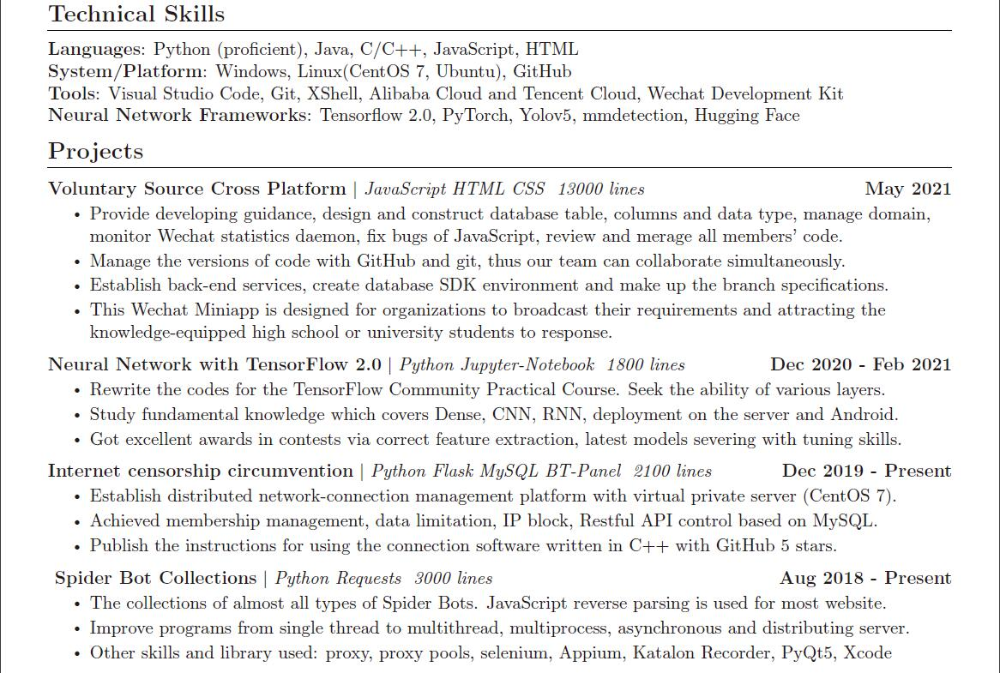
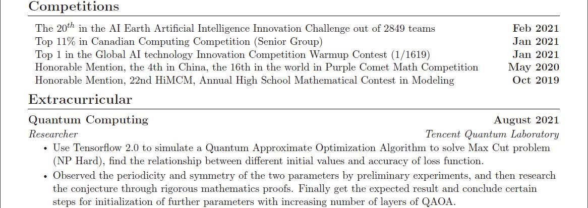

<!-- # Peter HomePage -->

<h1 align="center">Peter's Town</h1>

<h3 align="center">Software Developer and Interest in AI Competition and Quantum Computing</h2>

<h3 align="center">Freshman and looking for 2022 Summer internship</h2>

- Software Development
- Back-End Development & Operation
- Data Science / TensorFlow2
- Currently learning DevOps
<!-- I’m currently learning Tensorflow 2.0 and Contineous Intergration. -->

<!-- 🔭 I’m currently working on Web Deployment and Operation

🌱 

👯 I’m working for on [Tech4GoodCN](https://github.com/Tech4GoodCN) -->
<!--
**YHPeter/YHPeter** is a ✨ _special_ ✨ repository because its `README.md` (this file) appears on your GitHub profile.

Here are some ideas to get you started:

- 🔭 I’m currently working on ...
- 🌱 I’m currently learning ...
- 👯 I’m looking to collaborate on ...
- 🤔 I’m looking for help with ...
- 💬 Ask me about ...
- 📫 How to reach me: ...
- 😄 Pronouns: ...
- ⚡ Fun fact: ...

coour setting: &title_color=FFFFFF&text_color=FFFFFF&icon_color=FFFFFF&bg_color=DEG,EF0A6A,B6359C
-->

